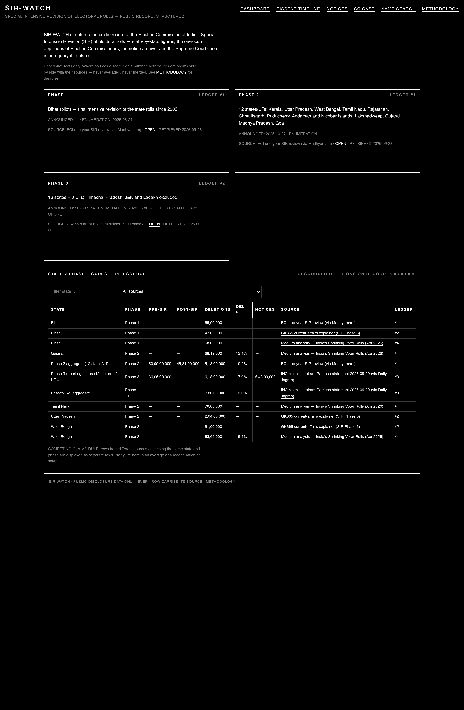

# SIR-WATCH

**Structured public record of the Election Commission of India's Special Intensive Revision (SIR) of electoral rolls — in one queryable place.**

Live: https://sir-watch.vercel.app

## What it does

- **Dashboard** — state × phase figures (pre-SIR roll, post-SIR roll, deletions, deletion %, notices issued), one row per *source*. ECI press-note figures and opposition/analyst claims sit side by side and are never merged.
- **Dissent timeline** — objections raised on record by Election Commissioners during the SIR, each with its source. The ECI's denials are part of the record too.
- **Notice archive** — every ECI SIR order/notice/press note, hashed (SHA-256) and sealed with retrieval date.
- **SC case tracker** — *ADR vs ECI* (WP Civil 640/2025) filings, hearings, orders.
- **Name search** — name-by-name deletion records recovered from published rolls, exactly as published. EPIC numbers never stored or displayed.

## Honesty contract

1. **Canonical verbatim** — figures and descriptions reproduced exactly as published. No paraphrase, no estimates, no interpolation.
2. **Competing claims never merged** — no averages, no reconciliations.
3. **Provenance of every row** — each ingestion batch sealed with source URL, retrieval date, SHA-256, row count; every row carries its ledger ID.
4. **No conclusions** — a deletion record is a record of removal as stated by the source, nothing more.

See `/methodology` in the app for the full contract.

## Stack

Next.js 14 (App Router) · TypeScript · Neon Postgres · no frameworks beyond the design system.

## Data

All data enters through `scripts/ingest_*.py`, each sealing a ledger batch. Raw files live under `data/raw/` with `.provenance.json` sidecars. Nothing is hand-edited into the database.

## License

MIT — public data belongs to the public.
